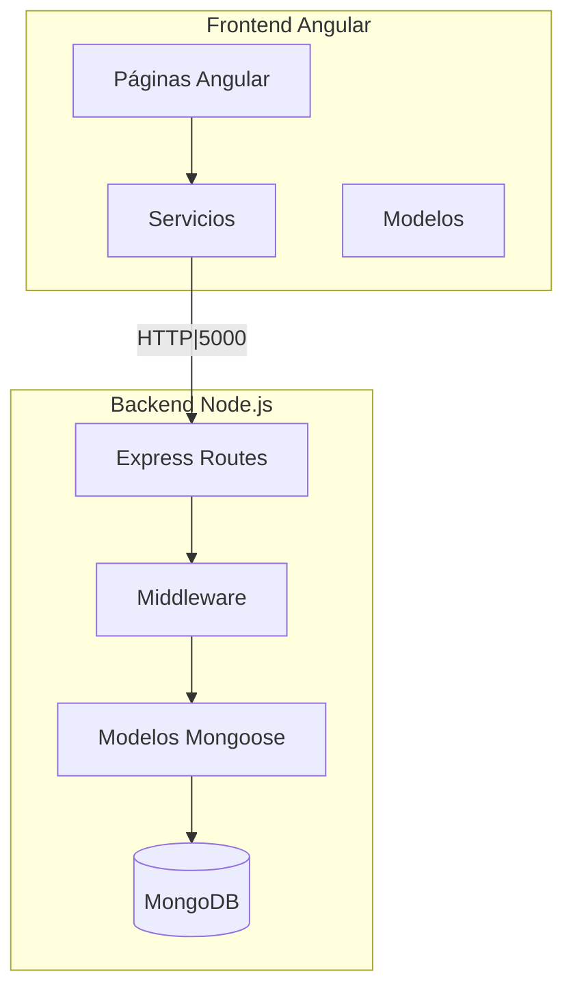

# 📋 INFORME DE ANÁLISIS EXHAUSTIVO DEL PROYECTO TELECABLE

---

## 1. RESUMEN EJECUTIVO

Este informe presenta un análisis completo del proyecto Telecable, que consiste en un sistema de gestión de clientes de televisión por cable con frontend Angular y backend Node.js/Express con MongoDB. Se han identificado múltiples áreas de mejora en seguridad, optimización, código duplicado y mejores prácticas de desarrollo.

---

## 2. PROBLEMAS DE SEGURIDAD CRÍTICOS

### 2.1 Credenciales Hardcodeadas en el Backend

**Archivo:** [`telecable/backend/server.js:28`](telecable/backend/server.js:28)

```javascript
const hashedPassword = await bcrypt.hash('admin123', 10);
```

**Problema:** La contraseña del administrador por defecto está hardcodeada. Esto representa un riesgo grave de seguridad.

**Recomendación:** 
- Utilizar variables de entorno para credenciales sensibles
- Implementar un sistema de configuración basado en archivos `.env`
- Forzar cambio de contraseña en el primer inicio de sesión

---

### 2.2 URLs Hardcodeadas en el Frontend

**Archivos:**
- [`telecable/frontend/telecable-app/src/app/services/auth.service.ts:12`](telecable/frontend/telecable-app/src/app/services/auth.service.ts:12)
- [`telecable/frontend/telecable-app/src/app/services/user.service.ts:11`](telecable/frontend/telecable-app/src/app/services/user.service.ts:11)
- [`telecable/frontend/telecable-app/src/app/services/preregistro.service.ts:9`](telecable/frontend/telecable-app/src/app/services/preregistro.service.ts:9)
- [`telecable/frontend/telecable-app/src/app/services/config.service.ts:9`](telecable/frontend/telecable-app/src/app/services/config.service.ts:9)
- [`telecable/frontend/telecable-app/src/app/services/technician.service.ts:10`](telecable/frontend/telecable-app/src/app/services/technician.service.ts:10)

```typescript
private api = 'http://localhost:5000/api/auth';
```

**Problema:** Todas las URLs de API están hardcodeadas con `localhost:5000`, lo que impede el despliegue en diferentes entornos.

**Recomendación:** 
- Crear un archivo de entorno (`environment.ts`) con las configuraciones por entorno
- Implementar un interceptor HTTP para manejar la base URL dinámicamente

---

### 2.3 Ausencia de Autenticación en Rutas del Backend

**Archivo:** [`telecable/backend/routes/users.js:5-10`](telecable/backend/routes/users.js:5-10)

```javascript
router.get("/",async(req,res)=>{
  const users = await User.find()
  res.json(users)
})
```

**Problema:** Las rutas de usuarios no tienen middleware de autenticación. Cualquier persona puede acceder, crear, modificar o eliminar usuarios.

**Recomendación:**
- Implementar middleware de autenticación JWT en todas las rutas protegidas
- Agregar validación de roles (admin, technician, user)

---

### 2.4 Validación Insuficiente de Entrada

**Archivo:** [`telecable/backend/routes/preregistros.js:9-29`](telecable/backend/routes/preregistros.js:9-29)

```javascript
const { nombre, telefono, direccion } = req.body;
if (!nombre || !telefono || !direccion) {
  return res.status(400).json({ error: '...' });
}
```

**Problema:** Solo se valida que los campos existan, pero no se valida el formato (longitud, caracteres especiales, etc.).

**Recomendación:**
- Implementar biblioteca de validación como `joi` o `express-validator`
- Validar formato de teléfono, longitud de nombres, etc.

---

### 2.5 Contraseña en Respuesta JSON

**Archivo:** [`telecable/backend/routes/auth.js:61-68`](telecable/backend/routes/auth.js:61-68)

**Problema:** Aunque el código usa `-password` en algunas consultas, hay inconsistencias en la exclusión de campos sensibles.

**Recomendación:**
- Crear un middleware que automáticamente excluya campos sensibles de todas las respuestas
- Estandarizar la transformación de objetos usuario

---

## 3. PROBLEMAS DE CÓDIGO DUPLICADO O REDUNDANTE

### 3.1 Duplicación de Funcionalidad de Reportes

**Archivos:**
- [`telecable/backend/models/user.js:3-35`](telecable/backend/models/user.js:3-35) - Esquema de reportes嵌入ado en User
- [`telecable/backend/models/report.js`](telecable/backend/models/report.js) - Modelo de Report separado

**Problema:** Existen dos lugares donde se almacenan reportes:
1. Dentro del esquema `userSchema` como subdocumento
2. Como colección separada `Report`

Esto causa inconsistencia de datos y confusión.

**Recomendación:**
- Eliminar uno de los dos sistemas (recomendado: mantener solo la colección separada para mejor escalabilidad)
- Migrar datos existentes y unificar la lógica

---

### 3.2 Código Duplicado en Generación de Contratos

**Archivos:**
- [`telecable/backend/generarContratos.js`](telecable/backend/generarContratos.js)
- [`telecable/backend/actualizarContratos.js`](telecable/backend/actualizarContratos.js)

**Problema:** Ambos archivos tienen lógica muy similar para generar números de contrato. El código está duplicado.

**Recomendación:**
- Crear un módulo compartido `contratoUtils.js` con la función `generarNumeroContrato()`
- Reutilizar en ambos scripts

---

### 3.3 Lógica Duplicada en Login

**Archivos:**
- [`telecable/backend/routes/auth.js:30-79`](telecable/backend/routes/auth.js:30-79) - Login admin
- [`telecable/backend/routes/auth.js:211-266`](telecable/backend/routes/auth.js:211-266) - Login usuario

**Problema:** La lógica de autenticación está duplicada para admin y usuario.

**Recomendación:**
- Crear una función helper `validarCredenciales()`
- Reducir duplicación de código

---

### 3.4 Métodos de Carga de Datos Duplicados

**Archivo:** [`telecable/frontend/telecable-app/src/app/pages/admin-dashboard/admin-dashboard.ts:98-134`](telecable/frontend/telecable-app/src/app/pages/admin-dashboard/admin-dashboard.ts:98-134)

```typescript
loadReportes() {
  this.userService.getReports().subscribe({...});
  this.userService.getUsers().subscribe({...});
}

loadData() {
  this.userService.getUsers().subscribe({...});
}
```

**Problema:** Se cargan los mismos datos en múltiples funciones.

**Recomendación:**
- Consolidar en un solo método de carga
- Implementar patrón de estado compartido (NgRx o BehaviorSubject)

---

## 4. INCONSISTENCIAS EN EL CÓDIGO

### 4.1 Nombres de Campos Inconsistentes

**Archivo:** [`telecable/backend/models/user.js:87-89`](telecable/backend/models/user.js:87-89)

```javascript
'NOMBRE DEL SUSCRIPTOR': String,
'LOCALIDAD': String,
NUMERO: Number,
```

**Problema:** Algunos campos usan mayúsculas con espacios (legacy data) y otros usan camelCase.

**Recomendación:**
- Normalizar todos los nombres de campos
- Mantener transformación solo para compatibilidad con datos legacy

---

### 4.2 Validación de Contraseña Inconsistente

**Archivos:**
- [`telecable/backend/routes/auth.js:164`](telecable/backend/routes/auth.js:164): Mínimo 6 caracteres
- [`telecable/frontend/telecable-app/src/app/pages/registro-password/registro-password.ts:138`](telecable/frontend/telecable-app/src/app/pages/registro-password/registro-password.ts:138): Mínimo 4 caracteres

**Problema:** La validación de longitud de contraseña es diferente entre frontend y backend.

**Recomendación:**
- Unificar la validación (mínimo 8 caracteres recomendados)
- Centralizar validaciones en el backend

---

### 4.3 Uso Mixto de箭頭函數 y function

**Problema:** El código usa indistintamente arrow functions y funciones tradicionales.

**Recomendación:**
- Estandarizar el estilo (recomendado: arrow functions para callbacks, funciones tradicionales para métodos de clase)

---

### 4.4 Estados de Reportes Inconsistentes

**Archivos:**
- [`telecable/backend/models/user.js:19`](telecable/backend/models/user.js:19): `'Pendiente', 'En Revision', 'Asignado', 'En Proceso', 'Completado', 'Cancelado'`
- [`telecable/backend/models/report.js:32`](telecable/backend/models/report.js:32): `'pendiente', 'atendido'`

**Problema:** Los valores de estatus son diferentes entre los dos modelos de reportes.

**Recomendación:**
- Unificar los estados en ambos modelos
- Usar constantes compartidas

---

## 5. OPORTUNIDADES DE OPTIMIZACIÓN

### 5.1 Consultas a Base de Datos No Optimizadas

**Archivo:** [`telecable/backend/routes/technicians.js:162-190`](telecable/backend/routes/technicians.js:162-190)

```javascript
const reportes = await User.find(
  { 'reportes.0': { $exists: true } },
  { numero: 1, nombre: 1, localidad: 1, reportes: 1 }
);
// Después procesa en memoria
reportes.forEach(cliente => {
  cliente.reportes.forEach(reporte => {...});
});
```

**Problema:** Trae todos los usuarios con reportes y procesa en memoria en lugar de usar agregación de MongoDB.

**Recomendación:**
- Usar `$unwind` y `$match` en pipeline de agregación
- Implementar paginación

---

### 5.2 Ausencia de Índices en MongoDB

**Archivo:** [`telecable/backend/models/user.js`](telecable/backend/models/user.js)

**Problema:** No se definen índices explícitos para campos frecuentemente buscados como `numero`, `telefono`, `nombre`.

**Recomendación:**
- Crear índices para campos de búsqueda frecuente:
```javascript
userSchema.index({ numero: 1 });
userSchema.index({ telefono: 1 });
userSchema.index({ nombre: 'text' });
```

---

### 5.3 Falta de Cache

**Problema:** Cada solicitud de configuración requiere una consulta a la base de datos.

**Archivo:** [`telecable/backend/routes/config.js:6-31`](telecable/backend/routes/config.js:6-31)

```javascript
async function getOrCreateConfig() {
  let config = await Config.findOne({ clave: 'system' });
  // ... crea si no existe
}
```

**Recomendación:**
- Implementar caché en memoria con `node-cache` o `redis`
- Invalidar caché solo cuando hay cambios

---

### 5.4 Carga Innecesaria de Datos en Frontend

**Archivo:** [`telecable/frontend/telecable-app/src/app/pages/admin-dashboard/admin-dashboard.ts:136-189`](telecable/frontend/telecable-app/src/app/pages/admin-dashboard/admin-dashboard.ts:136-189)

```typescript
loadData() {
  this.userService.getUsers().subscribe({...});
}
processData() {
  // Procesa TODOS los usuarios cada vez
}
```

**Problema:** Carga todos los usuarios y procesa en el cliente.

**Recomendación:**
- Implementar paginación en el backend
- Usar paginación en el frontend
- Mover cálculos de estadísticas al backend

---

### 5.5 Uso de console.log en Producción

**Problema:** Múltiples `console.log` a lo largo del código que expone información sensible en producción.

**Archivos:**
- [`telecable/backend/routes/auth.js:36`](telecable/backend/routes/auth.js:36): `console.log('Login attempt:', usuario);`
- [`telecable/backend/routes/auth.js:124-129`](telecable/backend/routes/auth.js:124-129): `console.log(CÓDIGO DE VERIFICACIÓN...)`

**Recomendación:**
- Usar biblioteca de logging como `winston` o `morgan`
- Eliminar logs sensibles en producción

---

## 6. MEJORES PRÁCTICAS DE DESARROLLO

### 6.1 Ausencia de Manejo de Errores Centralizado

**Problema:** No hay un manejador de errores global en Express.

**Recomendación:**
```javascript
// middleware/errorHandler.js
app.use((err, req, res, next) => {
  console.error(err.stack);
  res.status(500).json({ error: 'Error interno del servidor' });
});
```

---

### 6.2 No Hay Tests

**Problema:** No existen tests unitarios ni de integración.

**Recomendación:**
- Implementar Jest para backend
- Implementar Jasmine/Karma para frontend
- Cubrir al menos las funcionalidades críticas

---

### 6.3 Ausencia de TypeScript en el Backend

**Problema:** El backend usa JavaScript puro sin tipado.

**Recomendación:**
- Migrar a TypeScript para mejor mantenibilidad
- Usar JSDoc para documentar tipos si no se migra

---

### 6.4 Estructura de Proyecto Mejora

**Problema actual:**
```
backend/
├── server.js (todas las rutas)
├── routes/ (mezclado)
├── models/
└── scripts/
```

**Estructura recomendada:**
```
backend/
├── src/
│   ├── config/
│   ├── controllers/
│   ├── middleware/
│   ├── models/
│   ├── routes/
│   ├── services/
│   └── utils/
├── tests/
└── package.json
```

---

## 7. ANÁLISIS DE FUNCIONALIDADES PENDIENTES

### 7.1 Restablecimiento de Contraseña (Password Reset)

**Estado:** Parcialmente implementado

**Archivos relacionados:**
- [`telecable/backend/routes/auth.js:87-203`](telecable/backend/routes/auth.js:87-203)
- [`telecable/frontend/telecable-app/src/app/pages/registro-password/registro-password.ts`](telecable/frontend/telecable-app/src/app/pages/registro-password/registro-password.ts)

**Problemas encontrados:**
1. El código de verificación se muestra en la consola del servidor (seguridad)
2. No hay expiración real implementada correctamente
3. No hay opción de "olvidé mi contraseña" accesible desde el login
4. El frontend muestra el código en un alert (línea 118)

**Recomendaciones:**
- Implementar token JWT con expiración para restablecimiento
- Enviar código por SMS real (integrar servicio como Twilio)
- Crear página dedicada para "olvidé mi contraseña"
- Eliminar muestra de código en producción

---

### 7.2 Pre-registro de Precios Editables

**Estado:** Parcialmente implementado

**Archivos relacionados:**
- [`telecable/backend/models/config.js`](telecable/backend/models/config.js)
- [`telecable/backend/routes/config.js:55-72`](telecable/backend/routes/config.js:55-72)
- [`telecable/frontend/telecable-app/src/app/pages/preregistro/preregistro.ts`](telecable/frontend/telecable-app/src/app/pages/preregistro/preregistro.ts)

**Problemas encontrados:**
1. El precio está hardcodeado en el frontend (`precio: 200`)
2. No hay validación de precios negativos o excesivos
3. El modelo permite `precio` como campo opcional pero es requerido para el negocio

**Código problemático:**
```typescript
// preregistro.ts línea 46
precio: 200  // hardcodeado
```

**Recomendaciones:**
1. Obtener precios del backend:
```typescript
ngOnInit() {
  this.configService.getPrecios().subscribe(precios => {
    this.paquetes = precios.paquetes;
    this.precioDefault = precios.precioDefault;
  });
}
```
2. Agregar validación en backend:
```javascript
if (precio < 0 || precio > 10000) {
  return res.status(400).json({ error: 'Precio inválido' });
}
```

---

### 7.3 Agregación de Promociones

**Estado:** Implementado pero mejorable

**Archivos relacionados:**
- [`telecable/backend/routes/config.js:74-117`](telecable/backend/routes/config.js:74-117)

**Problemas:**
1. No hay validación de fechas de vigencia
2. No hay límite de promociones activas
3. No hay historial de modificaciones

**Recomendaciones:**
- Agregar validación:
```javascript
if (validoHasta && new Date(validoHasta) < new Date()) {
  return res.status(400).json({ error: 'La fecha de vigencia no puede ser anterior a hoy' });
}
```
- Limitar promociones activas (máximo 5-10)
- Agregar campo de "creadoPor" y "fechaModificacion"

---

### 7.4 Dirección en la Creación de Contratos

**Estado:** Implementado

**Archivos relacionados:**
- [`telecable/backend/routes/preregistros.js:53-128`](telecable/backend/routes/preregistros.js:53-128)
- [`telecable/backend/generarContratos.js`](telecable/backend/generarContratos.js)

**Problemas:**
1. El número de contrato se genera aleatoriamente pero no sigue un formato consistente
2. No hay validación de unicidad efectiva (puede fallar en concurrencia)
3. No hay forma de especificar dirección inicial del cliente en pre-registro desde el frontend

**Recomendaciones:**
- Mejorar generación de contratos:
```javascript
async function generarNumeroContrato() {
  const año = new Date().getFullYear().toString().slice(-2);
  const secuencia = await obtenerSiguienteNumero();
  return `${año}${String(secuencia).padStart(6, '0')}`;
}
```
- Agregar validación de dirección en pre-registro
- Implementar transactions de MongoDB para atomicidad

---

## 8. RECOMENDACIONES PRIORIZADAS

### 🔴 PRIORIDAD ALTA (Corregir inmediatamente)

| # | Problema | Archivo | Solución |
|---|----------|---------|----------|
| 1 | Credenciales hardcodeadas | server.js | Usar variables de entorno |
| 2 | Sin autenticación en rutas | routes/users.js | Agregar middleware JWT |
| 3 | URLs hardcodeadas | services/*.ts | Implementar environment files |
| 4 | console.log con datos sensibles | auth.js | Usar logger apropiado |

### 🟡 PRIORIDAD MEDIA (Corregir en sprint)

| # | Problema | Archivo | Solución |
|---|----------|---------|----------|
| 1 | Código duplicado | reportes en User y Report | Unificar modelos |
| 2 | Sin índices | models/*.js | Agregar índices MongoDB |
| 3 | Sin paginación | routes/*.js | Implementar pagination |
| 4 | Validación inconsistente | frontend/backend | Centralizar validaciones |

### 🟢 PRIORIDAD BAJA (Mejoras técnicas)

| # | Problema | Archivo | Solución |
|---|----------|---------|----------|
| 1 | Sin tests | proyecto completo | Agregar Jest/Jasmine |
| 2 | Sin TypeScript | backend | Migrar progresivamente |
| 3 | Estructura mejorable | backend | Reorganizar carpetas |
| 4 | Sin caché | config.js | Implementar node-cache |

---

## 9. DIAGRAMA DE ARQUITECTURA ACTUAL



---

## 10. CONCLUSIONES

El proyecto Telecable tiene una base funcional pero presenta múltiples oportunidades de mejora en términos de seguridad, rendimiento y mantenibilidad. Las áreas más críticas son:

1. **Seguridad**: Credenciales hardcodeadas y ausencia de autenticación
2. **Arquitectura**: Código duplicado y modelos inconsistentes
3. **Rendimiento**: Consultas no optimizadas y falta de paginación
4. **Mantenibilidad**: Sin tests y estructura mejorable

Se recomienda abordar primero los problemas de seguridad (prioridad alta) antes de agregar nuevas funcionalidades como el restablecimiento de contraseña completo o el sistema de promociones.

---

*Informe generado el 20 de marzo de 2026*
